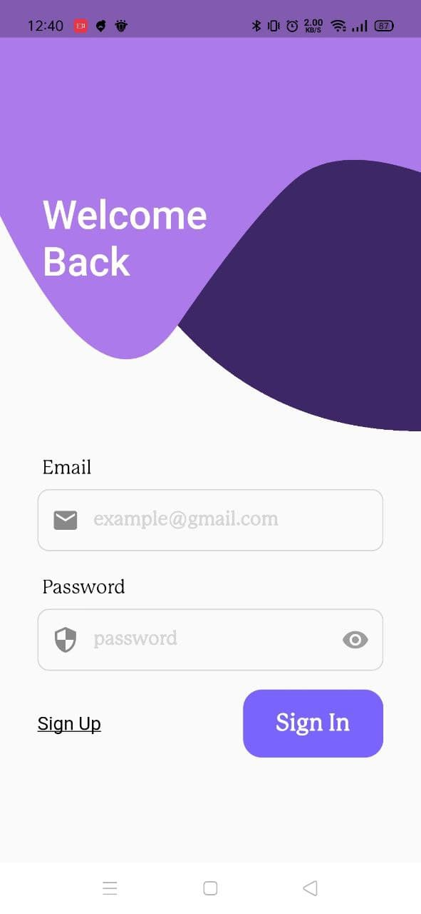
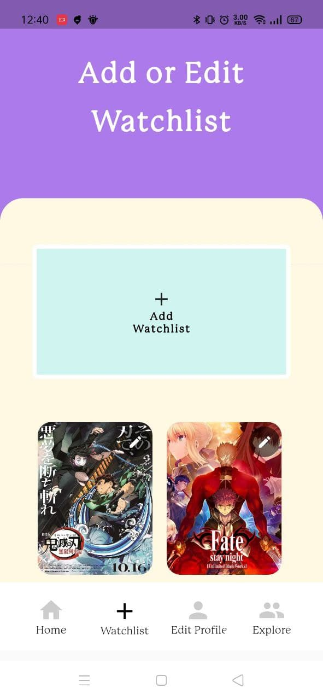
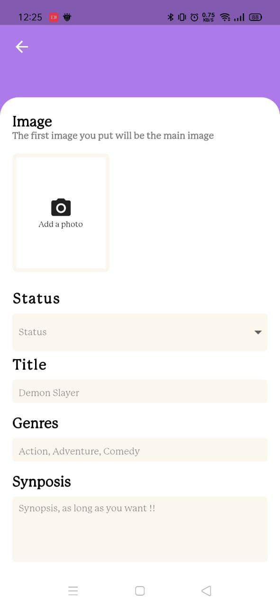
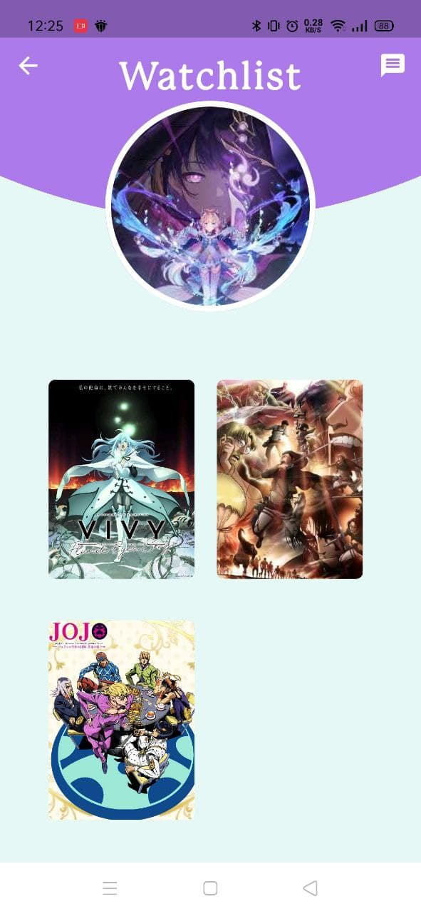
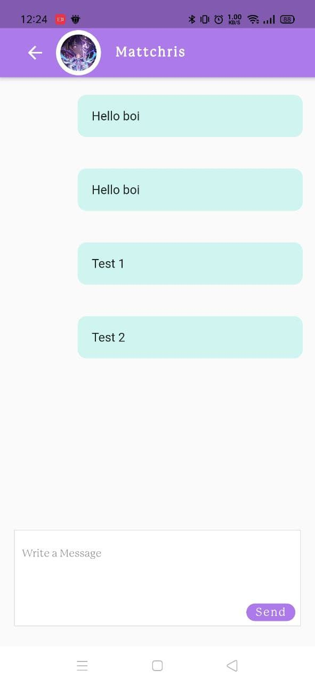

# Watchio

Watchlist App: Keep track of the movies listing that have been watched.

## Designs

Login Page

Home Page

Adding or Editing watchlist Page

Multiple Images can be added to the listing which will be shown as a slide image later in the movie listing

Profile Page

Explore Page

Realtime Chat Page

## Home Page Preview

<video src = "assets/videos/prev.mp4" width = "300"></video>
